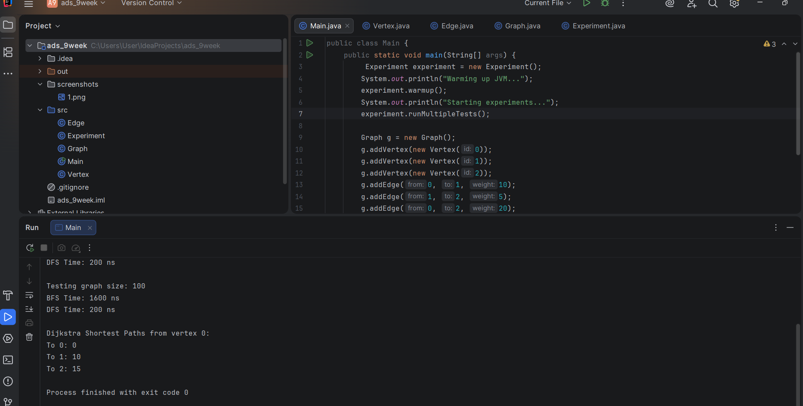

Project Overview
This project focuses on the implementation of a weighted graph data structure and the application of Dijkstra's algorithm to find the shortest paths. A graph in this system consists of vertices and weighted edges, represented through an adjacency list. This structure is designed to model networks where connections have specific costs or distances.

Class Descriptions
The implementation is built using an object-oriented approach with the following key components:
Vertex: Represents a node in the graph with a unique integer identifier.
Edge: Represents a connection between two vertices. Unlike standard edges, this class includes a weight field to store the cost of the connection.
Graph: The core class that manages the adjacency list. It includes methods for adding vertices and creating weighted edges between them.
Main: The entry point of the application used to demonstrate the shortest path calculations.

Dijkstra Algorithm Implementation
The primary focus of this implementation is Dijkstra's algorithm. This algorithm computes the shortest distance from a single source vertex to all other reachable vertices in a weighted graph.
The logic follows a greedy approach:
Initializing all distances from the source as infinity, except for the source itself, which is set to zero.
Repeatedly selecting the unvisited vertex with the smallest current distance.
Updating the distances of all adjacent neighbors if a shorter path is found through the selected vertex.
Marking the vertex as visited to ensure each node is processed efficiently.
As per the project requirements, the implementation utilizes simple loops and arrays/maps for distance tracking instead of a priority queue, ensuring clear and maintainable logic.
Experimental Results
The system was tested using a weighted graph structure to verify the correctness of the shortest path calculations. For example, in a graph where multiple paths exist between two nodes, the algorithm correctly identifies the path with the minimum total weight rather than the path with the fewest number of edges.
The results demonstrated that the algorithm successfully handles:
Direct connections between nodes.
Indirect paths where a combination of multiple edges results in a lower total weight.
Disconnected nodes, which correctly remain at an infinite distance.

Reflection
Implementing a weighted graph provided significant insights into how data structures can be adapted to solve optimization problems. The main challenge was modifying the existing edge representation to incorporate weights and ensuring that the distance update logic correctly handled vertex lookups. This implementation demonstrates a fundamental understanding of network optimization and efficient pathfinding.

